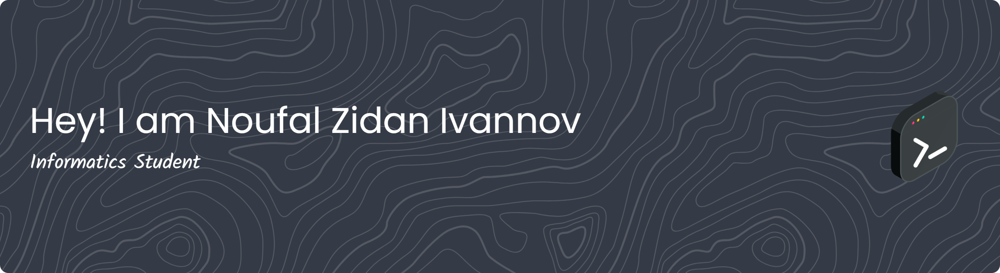

## ✨ About
👋 Hi, I’m Noufal Zidan Ivannov

I’m an Informatics student at Universitas Jenderal Soedirman, passionate about technology, coding, and continuous learning.

## 💡 Interests & Focus

- 🌱 Exploring Fullstack Development (Frontend + Backend)

- 🤖 Learning AI & Software Engineering

- 🛠️ Practicing clean code & problem-solving through projects

## 🪄 Skills
   

## 💻 Connect with me
 
